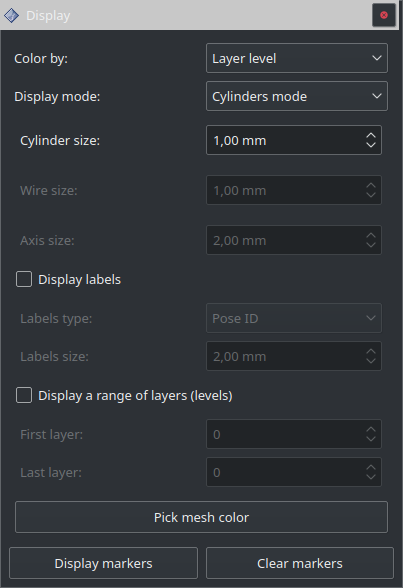

=======
Display
=======

Ce panneau contient les paramètres d’affichage de la trajectoire:

* **Color by:** Permet de changer la couleur de la trajectoire.

    * **Layer level:** Chaque niveau de la trajectoire aura une couleur distincte
    * **Layer index:** Chaque couche de la trajectoire aura une couleur distincte
    * **Speed:** Chaque vitesse robot aura une couleur distincte
    * **Pose type:** Chaque type de pose aura une couleur distincte
    * **Laser power:** Chaque puissance laser aura une couleur distincte

* **Display mode:** Permet de modifier la méthode d’affichage des poses et de la trajectoire. La trajectoire est affichée soit avec des cylindres soit avec des fils. L’affichage d’un trièdre représentant l’orientation de l’effecteur est possible dans les modes ``+ axis mode``.

    * **Cylinder/Wire/Axis size:** Permet de régler la taille de l’élément à l’écran.

* **Display labels:** Permet d’afficher les étiquettes choisies par les paramètres suivants:

    * **Labels type:** Permet de choisir d’afficher les identifiants des poses, les niveaux ou index des couches, ou les identifiants des poses par couche.
    * **Labels size:** Permet de régler la taille d’affichage des étiquettes.

* **Display a range of layers (levels):** Permet d’afficher uniquement les couches choisies:

    * **First layer:** Insérer le numéro du niveau de la 1ère couche à afficher.
    * **Last layer:** Insérer le numéro du niveau de la dernière couche à afficher.

* **Pick mesh color:** Permet de choisir la couleur du maillage (dans le cas où la génération de trajectoire utilise un maillage).

.. NOTE::
  En aucun cas le paramétrage de ce panneau ne modifiera la trajectoire générée (exemple: le programme robot), ce sont uniquement des paramètres de visualisation.

.. ATTENTION::
  Le mode d’affichage des poses est important lorsque l’on modifie une trajectoire:
   * En mode sélection ``Trajectory``: utiliser l’affichage ``Pose ID``
   * En mode sélection ``Layers``: utiliser l’affichage ``Layer level``
   * En mode sélection ``Within layer``: utiliser l’affichage ``Pose ID within layer``

