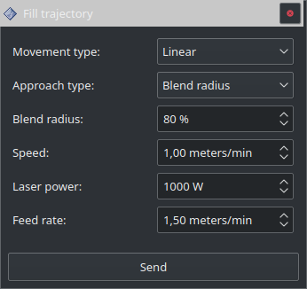

===============
Fill trajectory
===============

Ce panneau permet de définir les :ref:`Paramètres` par défaut sur chaque pose des trajectoires générées.
Il est nécessaire de valider les modifications avec le bouton ``Send`` puis de générer une nouvelle trajectoire.
