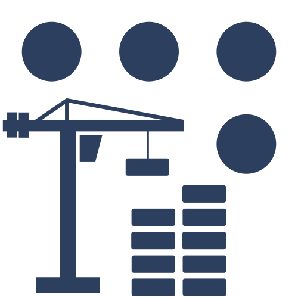

===================================================
Notice d'instructions de ROS Additive Manufacturing
===================================================

Raison Sociale et adresse
=========================
| Institut Maupertuis
| Contour Antoine de St Exupery
| Bâtiment ECAM
| 35170 BRUZ

Désignation du logiciel
=======================
ROS Additive Manufacturing (RAM) fait partie du programme `<http://wiki.ros.org/Industrial>`_. Ce projet a été développé par `l’Institut Maupertuis <http://www.institutmaupertuis.fr/>`_, un institut de recherche français qui travaille sur les procédés de robotique industrielle.
Il est composé d’outils (principalement des algorithmes et des interfaces graphiques) pour aider l’utilisateur à créer des trajectoires complexes pour la fabrication additive. Le projet se concentre sur l’impression de pièces métalliques avec des robots industriels. Il contient plusieurs outils: outil de génération de trajectoire, outil de visualisation, outil d’édition, etc.

Règles de sécurité de base
==========================
Avant de lancer un programme sur le robot l’utilisateur se doit d’assurer sa sécurité et celle des autres. L’opérateur du robot est responsable des dommages qui peuvent être causés par une mauvaise utilisation du robot et de ses équipements.

Sommaire
========
.. toctree::

  installation
  introduction
  displays
  views
  frames
  entry_exit_strategies
  fill_trajectory
  path_planning
  display
  modify_trajectory
  trajectory_utilities
  pose_information
  trajectory_information
  example_guide
  known_issues
  contact
