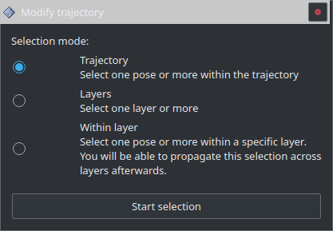
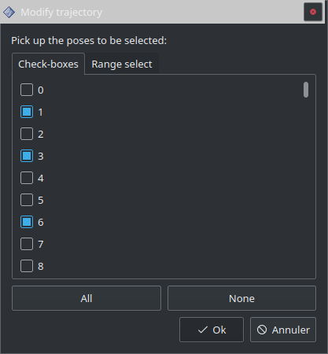
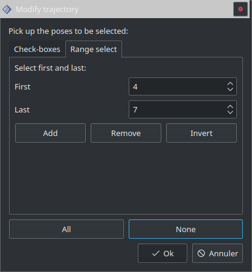
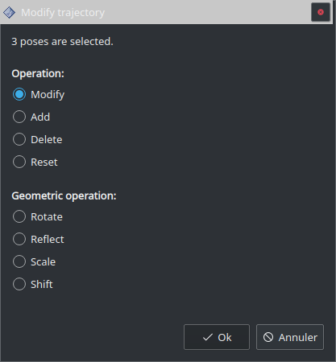

=================
Modify trajectory
=================

Pour modifier une trajectoire on sélectionne d'abord les poses à modifier puis on choisit le type d'opération à réaliser sur ces poses.

Sélection des poses
===================

3 modes de sélection sont disponibles:

* **Trajectory:** Permet de sélectionner une ou plusieurs poses sur l’ensemble de la trajectoire.
* **Layers:** Permet de sélectionner une ou plusieurs couches de la trajectoire.
* **Within layer:** Permet de sélectionner une couche, d’y sélectionner une ou plusieurs poses et de propager la sélection à d’autres couches.

Within layer
------------

Uniquement dans le cas du mode ``Within layer``, une fenêtre de sélection apparaît. Cette fenêtre permet de choisir la couche dans laquelle on va sélectionner des poses (la 1ère couche possède le numéro 0).

.. image:: temp_static/modify_trajectory/pick_a_layer.png
   :align: center

La sélection des [poses / couches / poses à l'intérieur d'une couche] se fait de la même manière. Les poses sélectionnées sont entourés par des sphères grises légèrement transparentes.

Le bouton ``All`` permet de sélectionner tous les éléments tandis que ``None`` efface la sélection.

Sélection manuelle
------------------

Cochez individuellement les cases des éléments que vous souhaitez sélectionner.

Sélection de plages
-------------------

Ce mode permet de sélectionner rapidement une plage d'éléments. Indiquez l'index de l'élément de début et de fin de sélection. 3 options:

* ``Add``: Ajoute la plage d'éléments à la sélection (les éléments déjà sélectionnés le restent).
* ``Remove``: Enlève la plage d'éléments à la sélection (les éléments non sélectionnés le restent).
* ``Invert``: Inverse la sélection pour la plage d'éléments: les éléments sélectionnés ne le seront plus et inversement.

Type d'opération à réaliser
===========================

Une fois la sélection validée les sphères grises deviennent opaques et la fenêtre suivante apparaît:

L'opération s'appliquera uniquement sur les poses sélectionnées précédemment.

Modify
------

Permet de modifier la pose, les paramètres remplis dans :ref:`Fill Trajectory` et les ``Polygon start``/``Polygon end`` des poses sélectionnées:

  .. |modify_1| image:: temp_static/modify_trajectory/modify_1.png
   :width: 50 %

  .. |modify_2| image:: temp_static/modify_trajectory/modify_2.png
   :width: 50 %

|modify_1| |modify_2|

Deux modes de modification existent:

* ``Relative``: Pour chaque pose sélectionnée la valeur entrée dans l'interface sera ajoutée au paramètre de la pose.
* ``Absolute``: Pour chaque pose sélectionnée la valeur entrée écrasera le paramètre de la pose.

Exemple avec ``Relative``, nous ajoutons `-100` à la valeur ``laser_power`` sur les pose `0` et `1` de la trajectoire. Trajectoire de base:

.. code-block:: YAML

    Pose 0
     - laser_power = 0
    Pose 1
     - laser_power = 1000
    Pose 2
     - laser_power = 200

Trajectoire obtenue:

.. code-block:: YAML

    Pose 0
     - laser_power = -100
    Pose 1
     - laser_power = 900
    Pose 2
     - laser_power = 200

Exemple avec ``Absolute``, nous modifions la valeur ``laser_power`` à `500` sur les poses `0` et `1` de la trajectoire. Trajectoire de base:

.. code-block:: YAML

    Pose 0
     - laser_power = 0
    Pose 1
     - laser_power = 1000
    Pose 2
     - laser_power = 200

Trajectoire obtenue:

.. code-block:: YAML

    Pose 0
     - laser_power = 500
    Pose 1
     - laser_power = 500
    Pose 2
     - laser_power = 200

Add
---
Ajoute une pose après chacune des poses sélectionnés.

Delete
------
Supprime les poses sélectionnés.

.. DANGER::
  Les poses supprimées ne peuvent pas être récupérées autrement qu'en utilisant le panneau :ref:`Trajectory utilities`.

.. ATTENTION::
  Si l’ensemble des poses formant une entrée ou une sortie est supprimé alors l'entrée et/ou la sortie seront de nouveaux générées à partir des derniers paramètres enregistrés dans le panneau :ref:`Entry and exit strategies`.

Reset
-----
Annule toutes les modifications sur les poses sélectionnées.

.. ATTENTION::
  Les poses qui ont été ajoutées avec :ref:`Add` seront supprimées.

Rotate
------
Permet une rotation des poses sélectionnées:

.. image:: temp_static/modify_trajectory/rotate.png
 :align: center

La rotation n'est possible qu'autour de l'axe Z, les orientations des poses sont affectées par cette rotation.

Reflect
-------
Permet d’effectuer une symétrie autour d'un point:

.. image:: temp_static/modify_trajectory/reflect.png
 :align: center

Scale
-----
Permet de redimensionner (agrandir / réduire) des points suivant un centre.

.. image:: temp_static/modify_trajectory/scale.png
 :align: center

.. ATTENTION::
  Si des poses appartenant à plusieurs couches sont sélectionnées, l'écart entre les couches est préservé.

Shift
-----
Permet de décaler des poses suivant une direction et un angle.

.. image:: temp_static/modify_trajectory/shift.png
 :align: center

* ``Shift direction angle``: Dans quelle direction décaler chaque couche. 0° correspond à l'axe X, 90° l'axe Y, 180° la direction -X etc. Défini la direction du décalage dans le plan XY.
* ``Z shift angle``: L'angle de décalage de chaque couche selon l'axe Z. Plus cet angle est grand plus les couches sont décalées loin.
