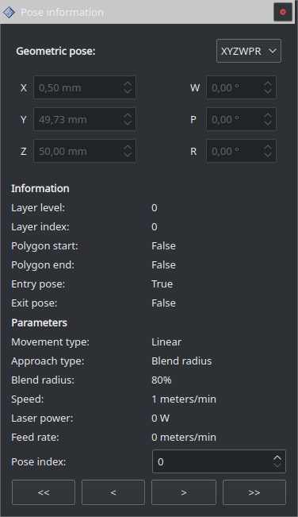

================
Pose information
================

Cette fenêtre référence toutes les informations sur les poses définies dans :ref:`Poses`.

``Pose index`` fait référence aux étiquettes affichées par l'option ``Display labels`` du panneau :ref:`Display`.

Les boutons en bas de la fenêtre permettent de naviguer dans les poses; les boutons aux extrémités permettent d'atteindre le début et la fin de la trajectoire.
